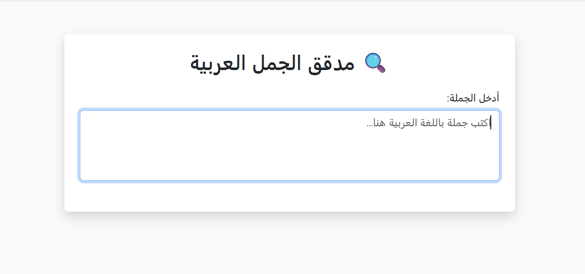

# Arabic Spell Checker

This project is an **Arabic Spell Checker** web application built using `Flask`.  
It allows users to write Arabic sentences, automatically detects misspelled words, and provides correction suggestions in real-time.

---

## Features

- **Real-time Spell Check**: Detect Arabic spelling mistakes instantly while typing.
- **Suggestions**: Show up to 5 alternative suggestions for each misspelled word.
- **Clickable Corrections**: Click any suggestion to replace the incorrect word in the sentence.
- **Modern UI**: Clean and responsive user interface with Arabic RTL support.

---

## Requirements

To run this project, make sure you have the following installed:

- Python `3.8` or higher
- Required Python libraries (install via `requirements.txt`)

---

##  How to Run  the Project
- Clone the repo.
- Install dependencies: pip install -r requirements.txt.
- Run the app from the terminal : python app.py
- Open your browser and go to: http://127.0.0.1:5000

---

## Demo Video

📽️ *This demo shows how the app detects Arabic spelling mistakes and provides correction suggestions in real-time.*

---